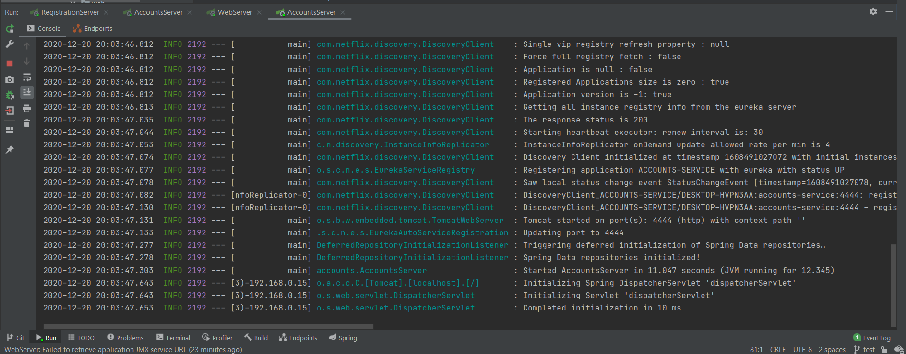

## Microservices handling report

### Microservice `account (2222)` and `web` are running and registered

Here we can see accounts service running on port 2222

... and Web service running on port 3333

### Registration service with two microservices registered

Here we can see Eureka server (registration) running correctly on port 1111

When this service is running, we can access the dashboard by using our preferred Web Browser: `localhost:1111`

### Second account microservice running on port 4444

Here we can see a new account microservice running on port 4444 and correctly registered

... and we can see here the new service on dashboard

### What happens when the microservice running on port 2222 is killed? Can the web service provide information about the accounts and why?

When we kill the `account 2222` microservice, we will get an error if we try to access this service via web.

Nevertheless, Eureka will take notice of the new service, and will re-register that microservice running on port 4444, so the service is reestablished successfully.

